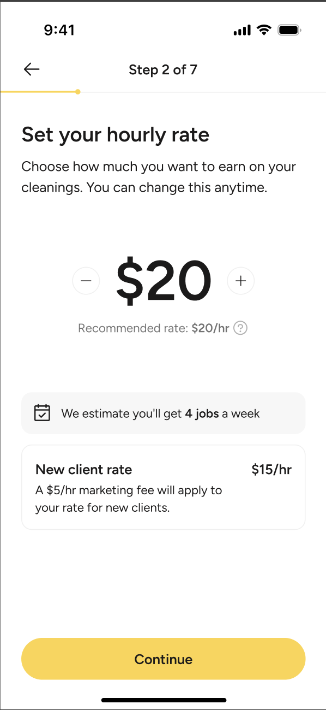
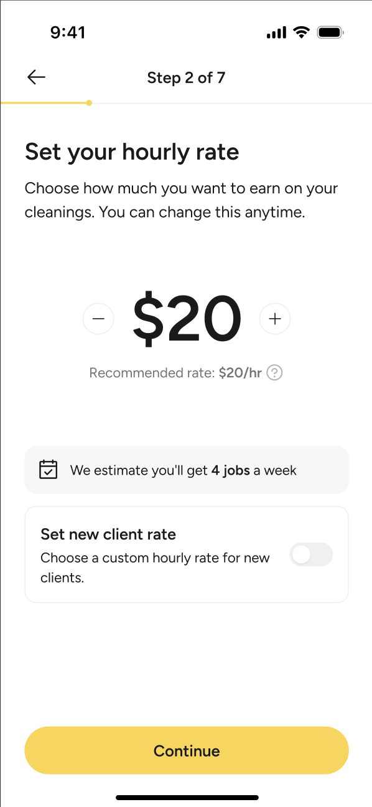
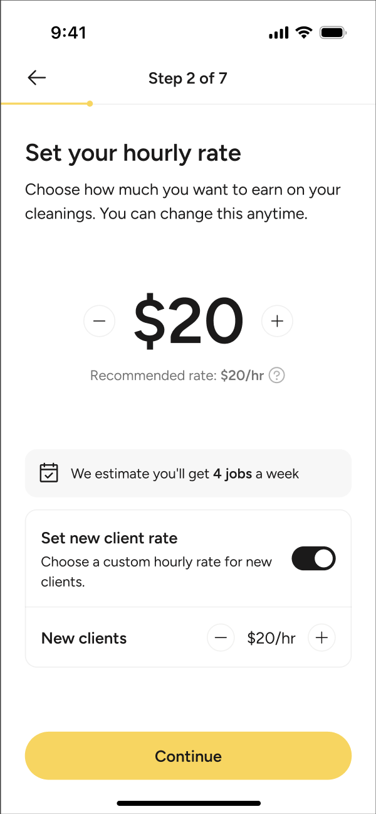

## Product Engineering Take Home

This project is a default Expo application with Nativewind support used to give you a head start in building out the Homeaglow take home assement. It isn't setup to be a full production application and there is nothing special about the setup.

In order to get started you should be able to `npm install` at the root of this project and then run `npm start`. The project is set to work on iOS, Android, and web and uses Expo Go to make it easier to get up and running. Feel free to pick which ever setup works best for you.

We have included some of our UI foundations in `src/ui` to include things like color, fonts, and spacing in the tailwind config. but otherwise this is a stock template application.

## The project

The goal of this take home assement is not to spend hour upon hours building a pixel perfect replication of the designs included. Instead, this should be a short (~1-2 hour long) excercise to see how you evaluate designs, turn them into functioning prototypes, structure your code, and what questions you would ask to better build the right solution.

### The designs

As part of joining the Homeaglow platform as a cleaner, new applicants can set the pay rate that they want to earn. We would like you to replicate the following screen:

Please include in it your thoughts on how you would fetch data to populate this screen, error handling, and what you would do when the applicant clicks continue.

Given that Homeaglow is a national brand, some states have different policies so some cleaners will see an alternative UI of

These screens show the different experience in those states.

### The goal

With the shorter timeline of this experiment we are looking into how you think and tackle a project and less into the exact match of the UI. Once you finish please send a link to a GitHub repo to us and our team will look it over and then use it to talk in your next interview.

Good luck and have fun!
